

<a href="https://github.com/esammahdi/YemekCalendar/" target="_blank" rel="noreferrer"> 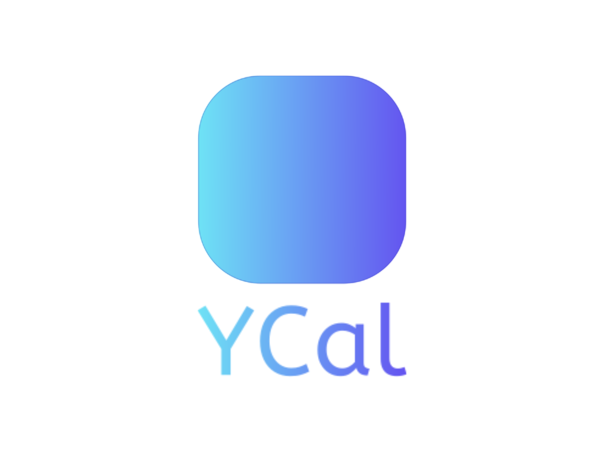 </a>  

# YemekCalendar

### 🍽️ **A Monthly Food Menu Application**
This application, built using Jetpack Compose, provides an intuitive and visually appealing way to browse and manage monthly food menus for selected institutions. Detailed overview of its features and capabilities are below.

 

 

 
<a href="https://developer.android.com/jetpack/androidx/releases/room" target="_blank" rel="noreferrer"> 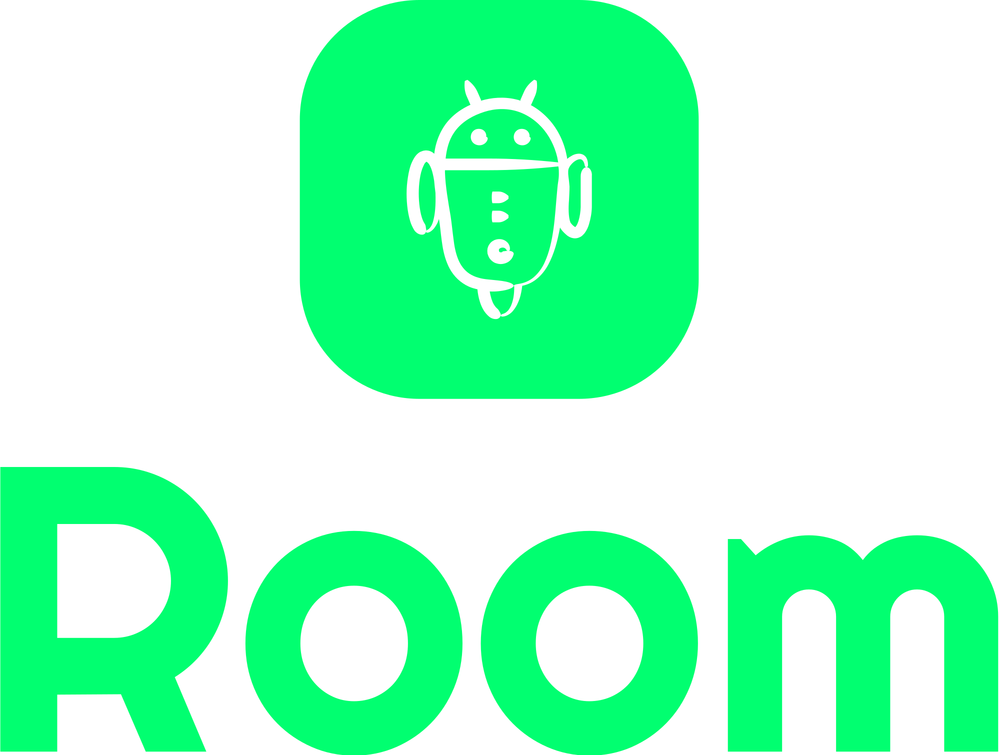 </a> 
<a href="https://developer.android.com/jetpack/guide#recommended-app-arch" target="_blank" rel="noreferrer"> 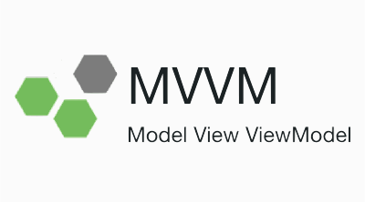 </a> 

 

## Table of Contents

* [Screenshots](#key-features)
* [Introduction](#introduction)
* [Key Features](#key-features)
* [Architecture](#architecture)
* [Installation](#installation)
* [Usage](#usage)
* [Known issues and limitations](#known-issues-and-limitations)
* [License](#license)
* [Authors and history](#authors-and-history)
* [Acknowledgments](#acknowledgments)

  
Screenshots
------------
* ### Authentication

  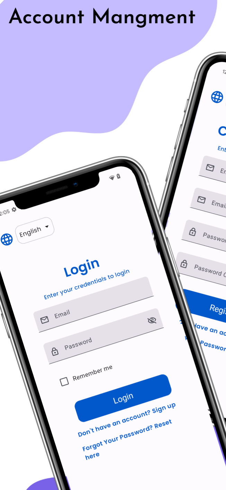
  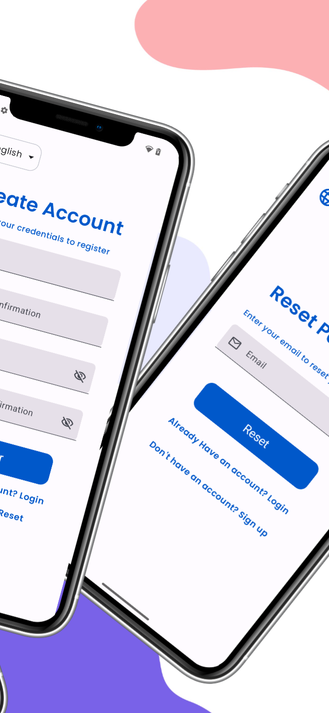
  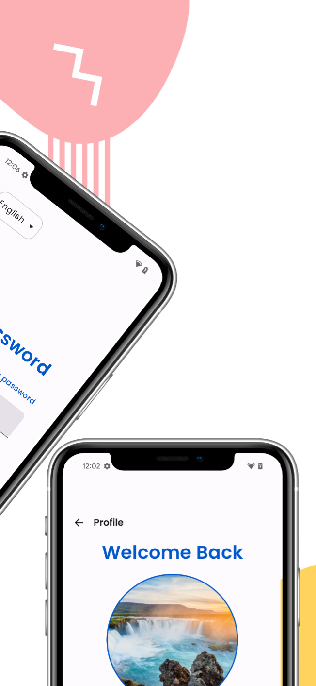

<!--
https://github.com/esammahdi/YemekCalendar/assets/95491137/30c1168e-f722-440e-bd67-fdfd0ff91d23

https://github.com/esammahdi/YemekCalendar/assets/95491137/9fe62cba-b307-44f8-8814-d976da71b4fa

https://github.com/esammahdi/YemekCalendar/assets/95491137/1ae4b2fa-ff78-4403-91d0-1fcaa3b50ac4
-->

* ### Calendar

  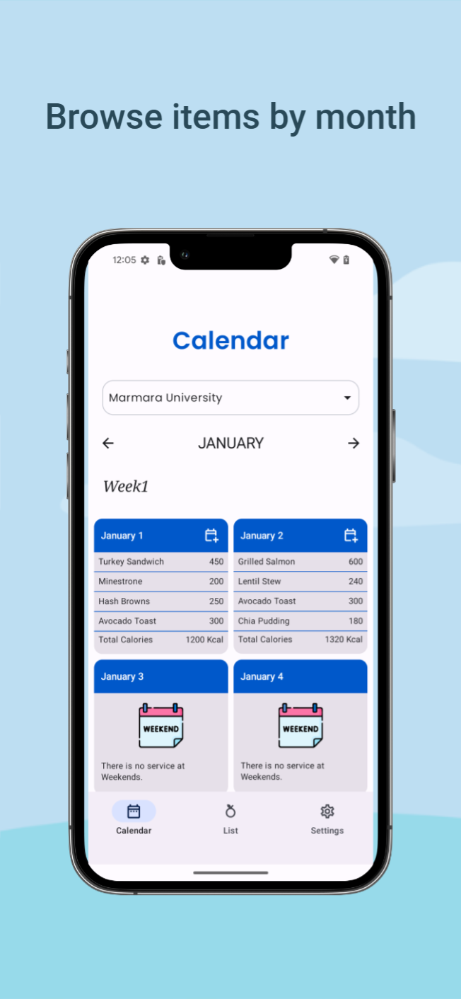
  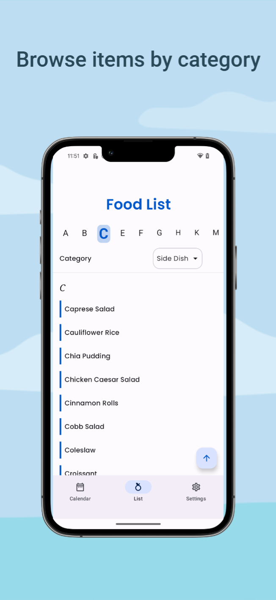
  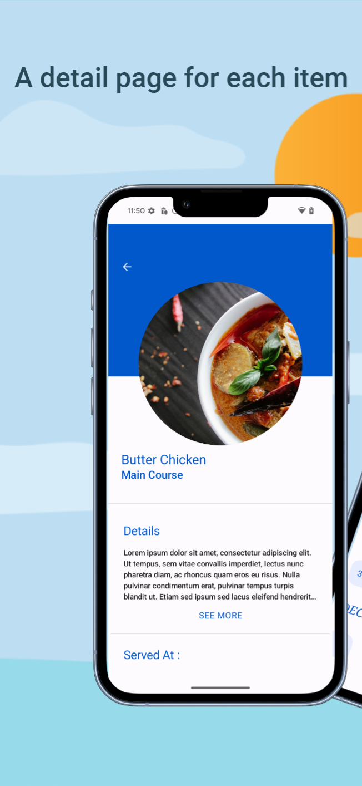
  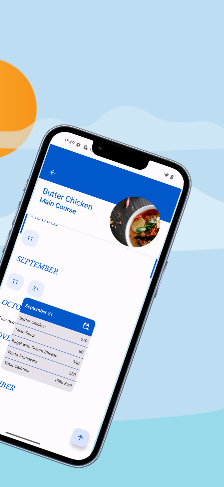

<!--
https://github.com/esammahdi/YemekCalendar/assets/95491137/63ea23b9-494e-45b1-ba8a-5001ddca0204 

https://github.com/esammahdi/YemekCalendar/assets/95491137/c91c8888-9257-46ab-be79-ff5288a7f2cc

https://github.com/esammahdi/YemekCalendar/assets/95491137/4295e422-bd2a-4a44-bcb3-7afb1a532ab3
-->

* ### Dynamic Theme

  
  
  

<!--
https://github.com/esammahdi/YemekCalendar/assets/95491137/3b0368ba-35e7-46c1-b2fa-39d72b495526
-->

 
* ### Settings

  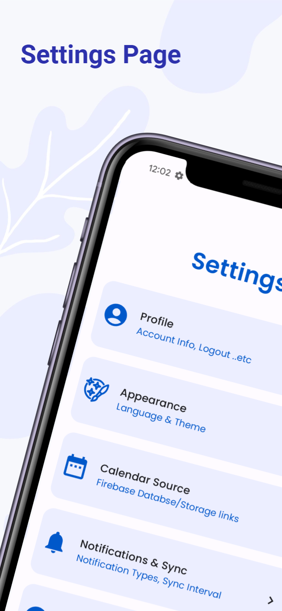
  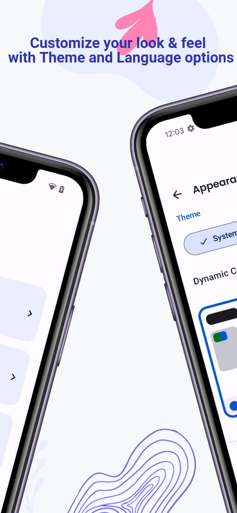
  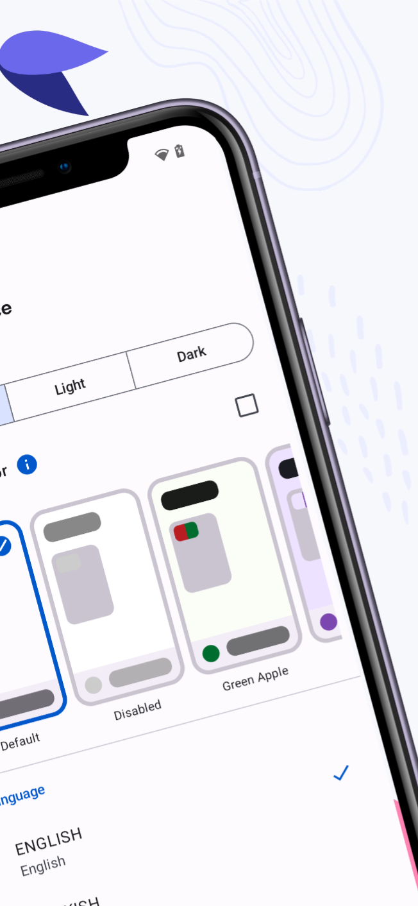
  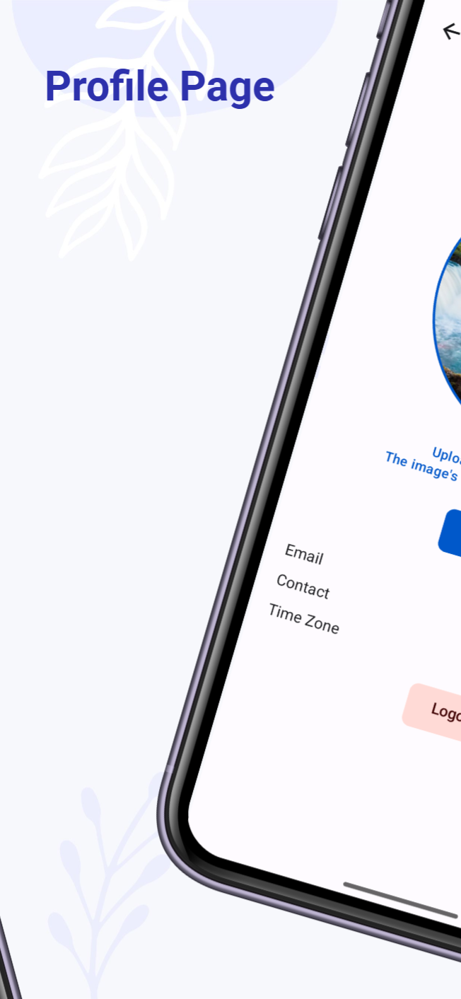
  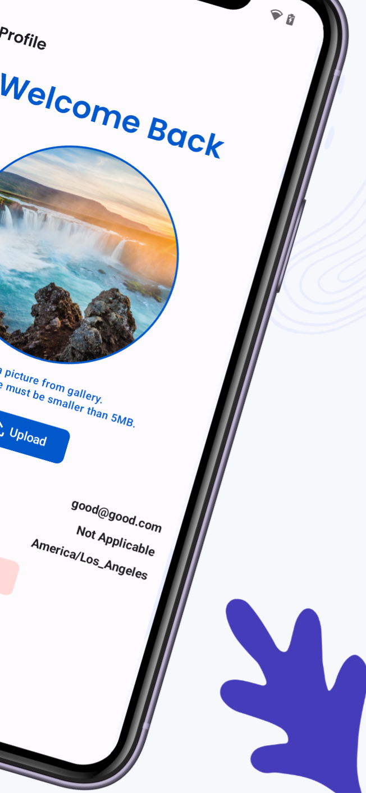

Introduction
------------

Key Features
------------

🖌️ **Theming and Design**
- **Predefined Custom Themes**: Choose from a selection of beautifully crafted themes.
- **Material You**: Dynamic theming support to match the system’s color scheme for a personalized look and feel.

🌍 **Multilingual Support**
- **Languages**: Supports Turkish, English, and Arabic, ensuring accessibility for a broader audience.

📶 **Local First**
- **Offline Functionality**: The app works seamlessly offline after the initial data fetch. Users can access menus without an internet connection.
- **Remember Me**: Users can stay logged in if they mark the 'Remember Me' checkbox, bypassing the login screen on subsequent launches.

🔄 **Firebase Integration**
- **Realtime Database**: Keeps data up-to-date with real-time synchronization.
- **Firebase Storage**: Allows users to save their profile pictures securely.

📅 **Calendar Integration**
- **Add to Calendar**: Users can add daily menus to their local calendars for easy access and reminders.
- **Browse by Food Item**: See which days specific food items are served with a dedicated calendar view.

👥 **User Account Management**
- **Account Creation and Login**: Supports account creation, login, and password reset via email.
- **Profile Picture**: Users can upload and save profile pictures using Firebase Storage.
  
🛠️ **User Experience Enhancements**
- **Back to Top Button**: A convenient button appears when scrolling down for quick navigation back to the top.
- **Pull-to-Refresh**: Easily refresh the data within the app to see the most recent updates.

### The following features are either yet to be implemented or have some problems. See  [Known issues and limitations](#known-issues-and-limitations) for more info.

📅 ~~**Calendar Source**~~

API Link Integration: Users can add a custom calendar source by providing an API link in the settings page. This allows for personalized and up-to-date menu data directly from the user’s preferred source.

🔄  ~~**Data Synchronization**~~ 
- **Worker API**: Schedules hourly data refreshes to ensure the latest information is available.
- **Service API**: Runs a background service to sync data from the cloud in real-time, keeping the app updated whether in the foreground or background.

🔔 ~~**Notifications**~~
- **Data change notifications** : Any remote data change event will result in a notifcation if the app is in the background (Only supported for firebase)

Architecture
------------

#### App Structure

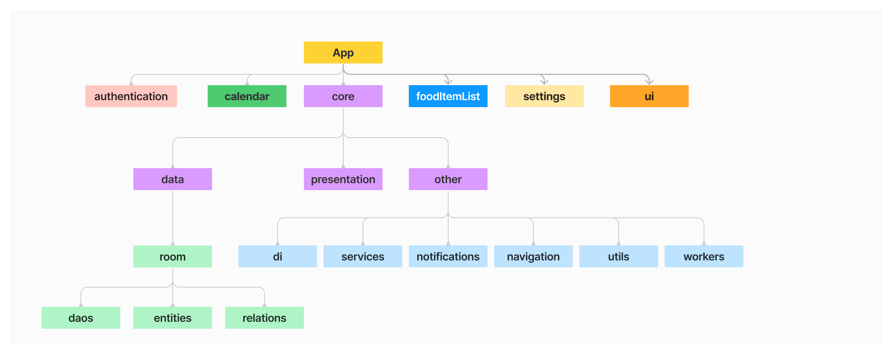

The app follows the MVVM (Model-View-ViewModel) architecture. MVVM helps in separating the user interface logic from business logic, making the code more modular and easier to manage.

For more information on MVVM architecture, refer to [this link](https://developer.android.com/jetpack/guide#recommended-app-arch).

#### Database Schema

The app uses two databases: one online and one offline.

- **Online Database**: Uses Firebase Realtime Database for real-time updates.
  
  
- **Offline Database**: Stores data locally for offline access and faster performance.
  
  

Installation
-------------
As of now. you have to clone the repo and build the app yourself after connecting it to the firebase service that you manage/your data provider gave you. However, in the next version of the app it is planned for the app to be API based. At that point ready apk files will be provided here on github and possibly on the Play Store.

Usage
------

Known issues and limitations
----------------------------
### App Wide Isuues
- **Language Support on previous APIs** :

  The app language does not change when the user selects a new language on devices with API level 28. Bigger APIs has yet to be tested. The reason for this is undetermined yet but it was observed that the locale is succuffully changed despite the language not changing.

- **Support for only Gregorian Calendar** :

     As of now, only gregorian calendar is supported. The dates are handled through unix-epoch time stamps, but the months list, date formatting, add event to calendar ..etc are coded with consideration for gregorian calendar only.

- **Large Paddings in Topbars** :

     Specially noticable in the sub-settings screens, theere is a large empty space above every appbar. But it is also there just in the whole app. Disabling `edgeToedge` support fixes it but that takes away an important feature. 

- **Background Worker** :

  The refresh data worker responsible for refreshing the data every two hours does not work despite it being registered as can be seen from the 'App Inspection' panel in Android Studio.

- **Notifications** :

    Notifications are not yet set up. The foreground service that is responsible for handling the events and showing either a Toast (when inside the app) or a notification is set up, but the notifications themselves are not yet created.
 
- **Calendar Source Settings** :
   * There are no settings for a calendar source that the user can provide himself yet.
   * A simple option to add the Firebase Configurations (Auth Domain, Realtime DB url and StorageBucket) could be implemented but that is too tightly coupled with Firebase and requires each provider to give the user three links. It also requires the provider make a logic to give access to that specific app in some way since the provider can not use the 'App Check' feature.
   * So instead of that it was decided to make the app API based and thus, completely Firebase-independent. The data layered is already structured in such way. What is required is to make an OpenAPI document with the required specifications. But this requires changing the  database schema. So this was left for the next version of the app. 
   * As of now, the sources are hard coded with the app and requires the one who build it to provide the Firebase services that follow the required rules.

- **YemekCalendarDropdownList** :
  
   1- The dropdown list background color is not suitable.
  
   2- The width of the dropdown is not consistent. Some times it takes the width of the entire screen and some times it wraps it's content width.
      The appropriate behavior is for it to match the width of the enclosing outlined button.

### Screen Specific Isuues
- **CalendarScreen** :
  * No Language support other than the online-source provided one : While the rest of the app support other languages the food items names are gotten from the online db directly and thus have no translation to other languages. To fix this, the entire schema of the database needs to be altered, in a way that makes every source have multiple food items lists, one list for each locale (e.g: food_items_en, food_items_tr ..etc). But this is too bothersome and thus have been left for the next version of the app which is planned to be API based.  
  * When refreshing the data through pull-refresh, the loading screen only waits for the instiutions list to load since the calendar day items require some time to load so at first the shimmer loading screen lifted but the page shows the 'No Calendar For this Month' message sine there are no items in the list yet. It takes some seconds until the items are loaded. The appropriate behavior is for the loading screen to continue until the calendar day items are loaded.
  * The month name in the month navigation bar is not localized when the language is changed. This is because the month list is an enumeration of gregorian calendar months. To solve this a logic to get the localized month name through `SimpleDateFormat("MMMM", Locale.getDefault()).format(date)` should be implemented.  
  

- **FoodDetailsScreen** :

  The header (that shows the food name and image) shows a vertical line with the primary color on the edges when in collapsed state.

- **Appearance Screen** :
    * The color schemes of some predefined-themes is not good and should be changed.
    * The 'Disabled Theme' should not be included in the theme list.   

License
-------

Authors and history
---------------------------

* Esam Bashir : The original author.

Acknowledgments
---------------
* [ Abdellah Ibn El Azraq (BBlueCoder) ](https://github.com/BBlueCoder/ViDown/tree/master) : His article about using Hilt with was realy helpfull. I also modeled some parts of the readme file after his project's readme file. 
* [Logo.com](https://logo.com/) : Used to design the application logo as well as some other logos for the readme file.
* [Previewed](https://previewed.app/) : Used to design the screenshots previews above.
